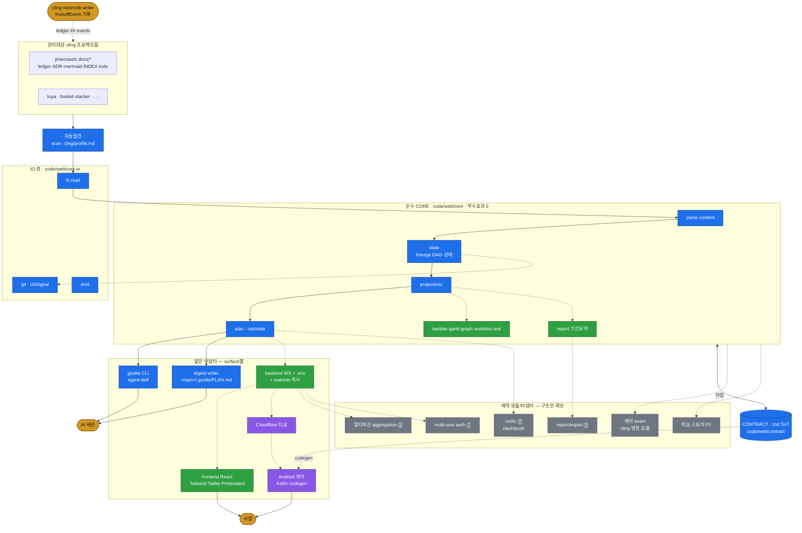

# M-0001 — gootte 전체 아키텍처

> 재사용 원리: 모든 surface 가 **CORE projections + CONTRACT 타입** 만 소비. parsing·state 재구현 0.
> 실선 = phase 1(이번 spec). 점선 = 후속 phase(어댑터/모듈 추가, CORE 무변경).

- 🔵 phase 1 (CORE·CONTRACT·CLI·digest·discovery) · 🟢 2차 웹 · 🟣 3차 터널/Android · ⚪ 예약(제어·학습)
