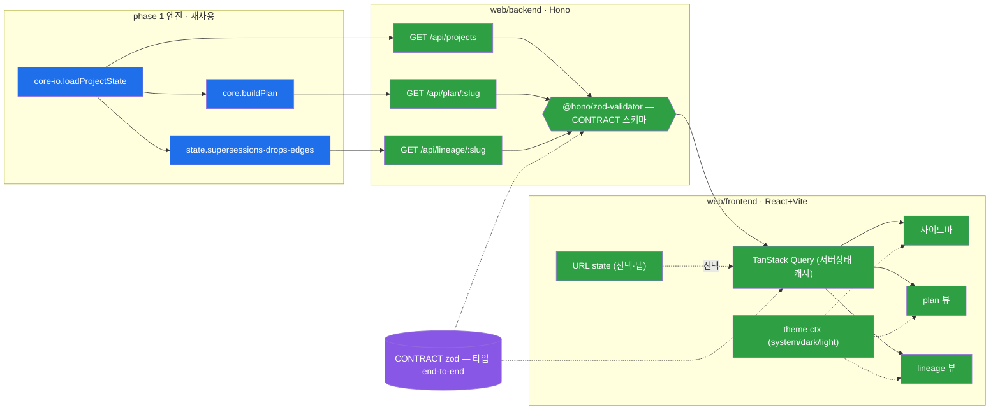

# M-0002 — web-dashboard 2a 데이터흐름

> M-0001(전체)의 phase 2a 상세. backend는 CORE 릴레이(계산·LLM 0), frontend는 렌더. 서버상태=TanStack Query(복제 X, INV-1).

- 🔵 phase 1 재사용 · 🟢 2a 신규(backend/frontend) · 🟣 CONTRACT(공유 타입 SoT)
- 2b = WS/watcher가 Q에 invalidate(즉시) · 2c = V2/V3에 칸반/Gantt/그래프.
