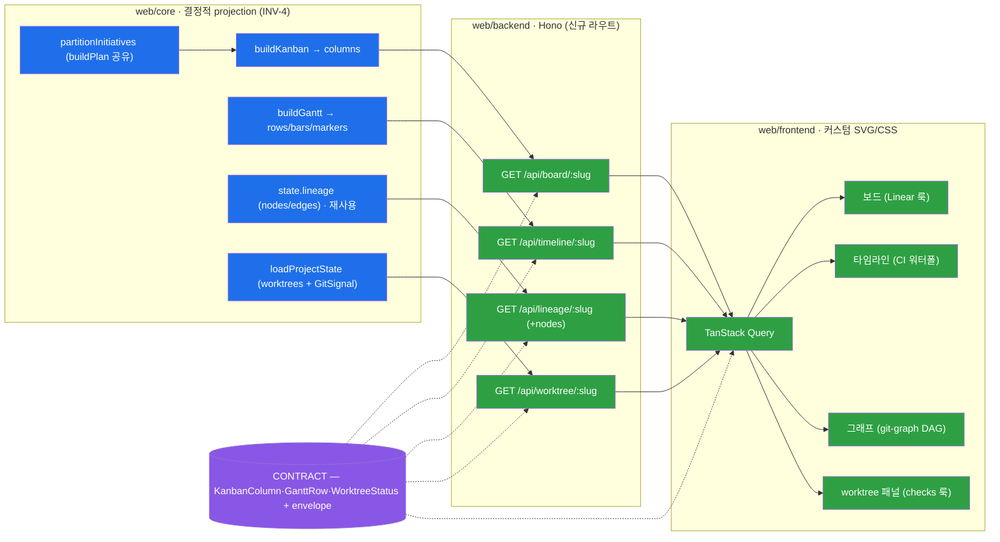

# M-0003 — web-viz 2c 시각화 데이터흐름

> M-0002(2a) 위 시각화 레이어. projection·kind·기간=CORE 결정적(INV-4), 프론트=커스텀 SVG/CSS 레이아웃.

- 🔵 CORE projection(결정적) · 🟢 2c 신규 backend/뷰 · 🟣 CONTRACT 공유 타입.
- 그래프는 신규 projection 없이 `state.lineage` 재사용(LineageResponse에 nodes 추가만).
- 뷰모드 토글(plan→리스트/보드/타임라인, lineage→체인/그래프)은 프론트 UI 상태(URL `?view=`).
