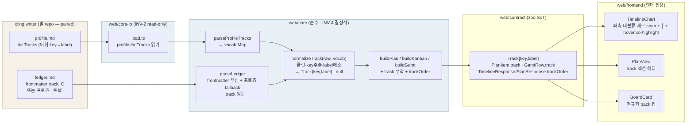

# M-0004 — track-grouping (2d)

> 소유 prose = `docs/roadmap/project-manager/track-grouping/spec.md`. M-0003(web-viz) 위 대분류 축.
> external-writer seam(cling writer + gootte reader) = KickoffEvent 동형.

- **하이브리드**(ADR-0001): frontmatter `track:` 있으면 읽고 없으면 프로즈 `트랙:` fallback.
- **label 해소**(ADR-0002): 카노니컬 key → profile `## Tracks` 어휘 · 레거시 프로즈 → 인라인 파생(verbatim).
- **그룹 렌더**(ADR-0003): 타임라인 = 좌측 세로 span + hover co-highlight · 리스트 = 섹션 헤더 · 보드 = 칩.
