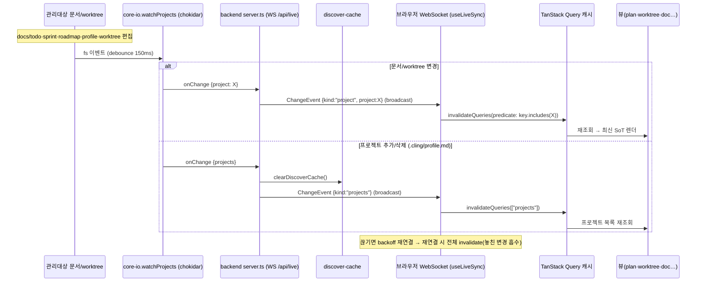

# M-0005 — web-realtime 2b 실시간 데이터흐름

> M-0002(2a) 위 확장 — 사용자가 수동 새로고침하던 갱신을 watcher push로 자동화(INV-3 웹 실현). 서버상태=TanStack Query(복제 X).

- 🔵 phase 1/2a 재사용(core-io·discover-cache·TanStack Q·뷰) · 🟢 2b 신규(watchProjects·WS broadcast·useLiveSync) · 🟣 CONTRACT `ChangeEvent`.
- coarse(프로젝트 단위) invalidate — 파일→뷰 매핑 없이 그 프로젝트 쿼리 전체(ADR-0004). WS 양방향(후속 제어 대비, ADR-0002).
