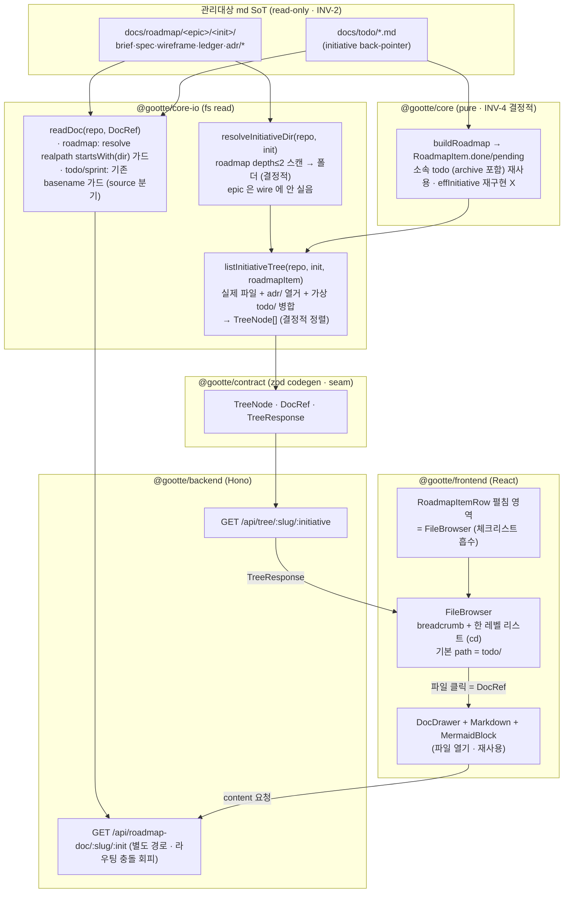

# M-0006 — roadmap-doc-browser (2e · W 트랙)

> 이니셔티브 폴더(실제 파일 + `adr/`) + 가상 `todo/`(effInitiative 합성)를 결정적 tree 로 나열 →
> 인라인 cd 브라우저(breadcrumb + 한 레벨 리스트) → 파일 클릭 → 기존 DocDrawer 뷰어. INV-2/4 read-only·결정적.

## 노드 메모
- **initiative→폴더 해소** — gootte 는 2-level `docs/roadmap/<epic>/<init>/` 이고 state 엔 slug 만 온다. `resolveInitiativeDir` 이 유일 소유자로 폴더를 해소(epic wire 미포함, ADR-0004 §0).
- **가상 `todo/`** — 실제 파일은 `docs/todo/` 에 흩어져 있으나, 이니셔티브 뷰에선 `buildRoadmap` 의 `RoadmapItem.done/pending`(archive 포함) 재사용해 `todo/<slug>.md` 가상 엔트리로 노출(INV-1 파생, `effInitiative` 재구현 X). 열면 기존 `readDoc({source:"todo"})`.
- **경계** — tree 는 이 이니셔티브 폴더 + 가상 todo/ 만. mermaid(`docs/mermaid/`)는 문서 열 때 `MermaidBlock` 인라인 렌더(트리엔 미노출). worktree 라이브 트리 = non-goal(ADR-0003).
- **read-path 결정적(INV-4)** — 열거·정렬 순수, LLM 0. roadmap read 가드 = `resolve(dir,relPath)` realpath 가 폴더로 startsWith(ADR-0004); todo/sprint basename 가드 별도 분기.
