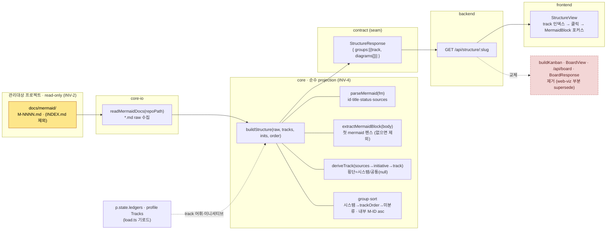

# M-0007 · web-structure 렌더 데이터흐름

> 🔴 plan "보드" 슬롯을 칸반 → **관리대상 프로젝트 저작 `docs/mermaid/` 렌더**로 교체. 소스=저작(ADR-0001) · track=`sources`→이니셔티브→track 파생(ADR-0002) · 칸반 완전 교체·web-viz 부분 supersede(ADR-0003). M-0002(2a 데이터흐름) 위 surface. **파일 rename 금지.**

## 데이터흐름 (read-only INV-2 · 결정적 INV-4)

## 재사용 (얇은 구현)
- **렌더** = 기존 `MermaidBlock`(lazy·테마·strict sanitize·실패 fallback) 그대로.
- **파싱** = `parseMermaid`(frontmatter) 에 `sources` + `extractMermaidBlock` 만 추가.
- **그룹핑** = `groupByTrack` + 서버 `trackOrder`(INV-4 verbatim). 리스트·타임라인과 동축.
- **경로·어휘** = core-io `load`(repoPath·profile Tracks·initiatives) 이미 로드.

## 경계
- gootte 는 `docs/mermaid/` **읽기만**(INV-2). 그림 SoT = 프로젝트 소유, `StructureResponse` = 파생(INV-1).
- 자동 import 추출은 **non-goal**(ADR-0001) — 언어별 파서 = gootte 정체성 밖.
